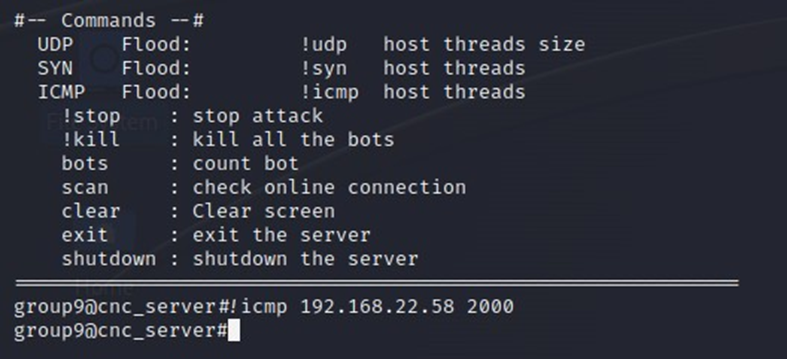

#CÔNG CỤ KIỂM SOÁT BOTNET VÀ TẤN CÔNG DDOS

##Nguồn tham khảo
Công cụ này được tham khảo từ kho lưu trữ : https://github.com/Leeon123/Python3-Botnet.git

Công cụ gồm 2 tệp chính: cnc.py và bot.py được viết bằng ngôn ngữ Python
- Tệp cnc.py khi được chạy sẽ đóng vai trò là một chương trình Command and Control có nhiệm vụ:
+ Lắng nghe các kết nối đến từ bot
+ Duy trì các kết nối
+ Lắng nghe và kết nối với Attacker
+ Nhận lệnh từ Attacker sau đó gửi lệnh cho các bot
- Tệp bot.py khi được chạy trên một máy tính thì máy tính đó sẽ trở thành một bot, có nhiệm vụ:
+ Thực hiện tạo kết nối trở về Command and Control Server với thông tin IP, Port được chỉ định trong nội dung tệp.
+ Nhận lệnh từ Command and Control Server, giải mã lệnh.
+ Thực hiện lệnh nhận được ứng với việc chạy các hàm tương ứng để thực hiện tấn công.

##Sử dụng

Bước 1. Chạy C&C để bắt đầu lắng nghe kết nối.
Lệnh chạy: python3 cnc.py <listen_port>

 
Bước 2. Chạy tệp bot.py. (image/Giả định đây là hành động của người dùng).
Lưu ý, trong tệp bot.py cần chỉnh IP và Port của C&C và Bot sẽ kết nối đến:

 
Lệnh chạy: python3 bot.py 

Bước 3. Kiểm tra kết quả trên C&C.
Sau khi các bot chạy bot.py, kết quả nhận được trên C&C Server thông báo có bot kết nối đến:

 
Bước 4. Kết nối Attacker đến C&C.
Attacker sử dụng Telnet kết nối đến chính cổng C&C đang lắng nghe, việc này sẽ trả về cho Attacker một giao diện dòng lệnh để gửi lệnh tấn công:

 
Bước 5. Thực hiện lệnh tấn công.
Attacker có thể xem hướng dẫn bằng cách gõ “?”:

Ví dụ tấn công ICMP Flood:

